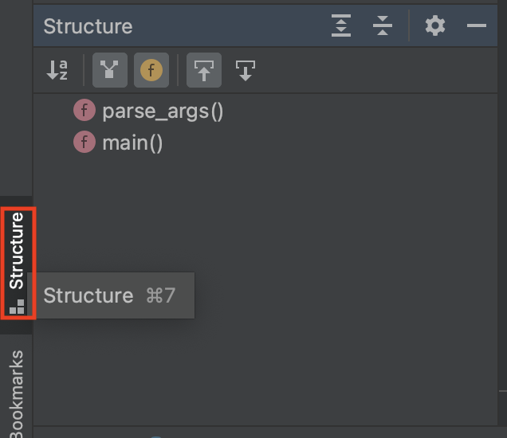
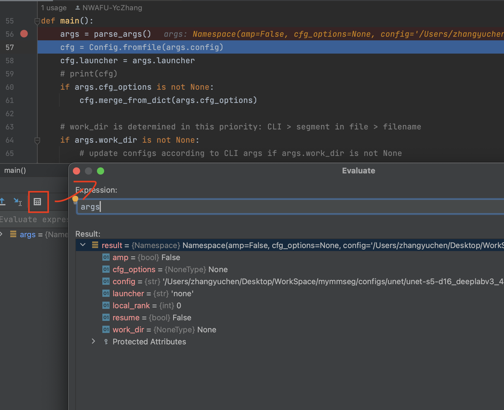

# <center>学习笔记</center>
## 一、Pycharm 使用

（一）、debug代码执行
首先 点击代码行号处，打断点，然后右键选择“debug **.py”即可开始
1. step over（上拐箭头）：执行代码行的下一步，不会进入子函数
2. step into（下箭头）：执行下一步，如果需要进入子函数，则跳转进去
3. step into my code（带标箭头）：与step into 作用相似，但是不会进入源码，即只会进入自己写的子函数
4. step out (上箭头)：跳出子函数，返回调用点

（二）、debug变量计算
1. 点击屏幕左下侧竖排按钮“structure”，会打开标签页，可以清晰的看到此文件中定义的变量、函数等数据

2. 点击Debugger 右侧 像计算器一样的小按钮“Evaluate Expression” 可以跳出标签页，方便进行变量计算


（三）、run config 
1. 右键选择modify run config，来配置运行python脚本时需要的参数，和脚本运行时的其他环境设置

2. run config中的配置如下图所示：

Parameters 是运行代码时需要加入的参数，Working directory是脚本运行时需要在的路径，比如要运行脚本时的指令为：
```python
python tools/train.py xxx --workdir xxx --sed xxxx
```
那么Parameters就设置成：xxx --workdir xxx --sed xxxx
Working directory 就设置成 path to tools‘s father dir(因为正确运行的命令是tools/train.py，所以要在tools的父目录执行这段代码，必须要这样做，因为很可能在脚本内部会对文件路径做文章，如果通过其他形式的路径运行代码，大概率会导致文件无法找到的错误)
